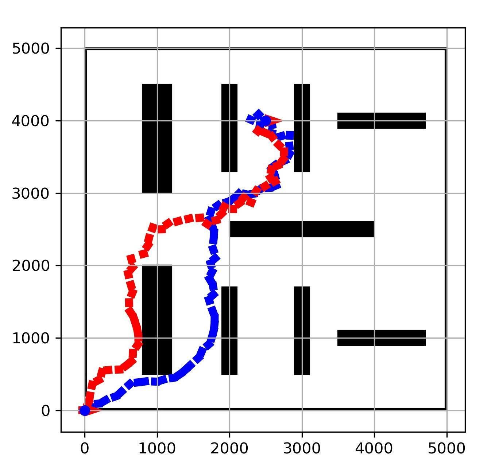
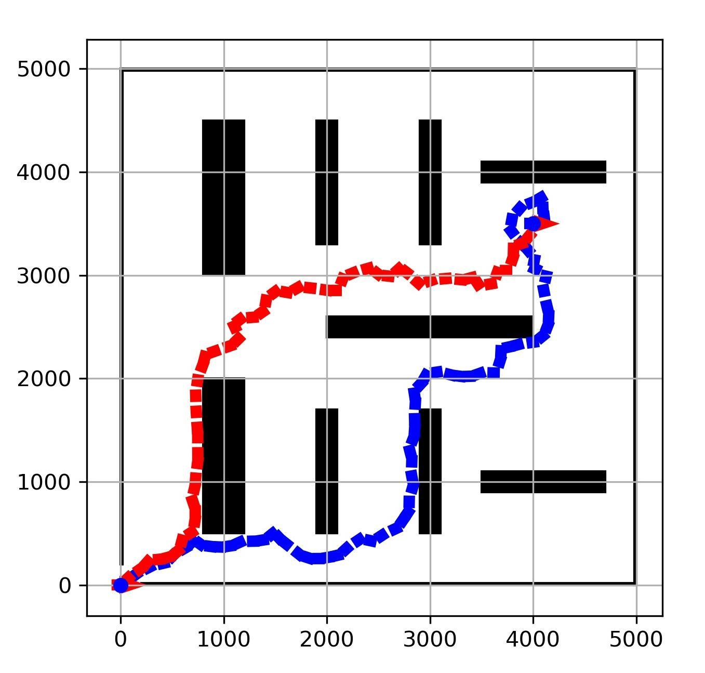

Main function: [RRT.py](RRT.py)

Instruction: [instruction.pdf](lab_2_instruction.pdf)

Full report: [report.pdf](lab_2_report.pdf)

 

### Objectives

The goal of this lab is to explore build autonomy into a simple two-wheeled non-holonomic robot. You will develop an RRT-based planner designed to get your robot to a desired goal state.

### Instructions

1. Robot model
    - Define fully observable system model in continuous space
    
    (black area: obstacles; start state position: (0, 0), orientation: 0)

2. Trajectory planning
    - Design metric definition for closest point to target point
    - Mathematically calculate achievable trajectories
    - Determine collision-free trajectories

### Experiment results

1. Different target state

| algorithm type |   target state   | run time | number of searched nodes | trajectory time |
| :------------: | :--------------: | :------: | :----------------------: | :-------------: |
|      RRT       | [2500, 4000, π]  |   4.31   |           326            |      37.3       |
|      RRT       | [2500, 4000, -π] |   4.88   |           334            |      38.1       |
|      RRT       | [2500, 4000, 0]  |   4.67   |           315            |      43.6       |
|      RRT       | [2500, 1000, π]  |   23.7   |           1498           |      23.7       |
|      RRT       | [2500, 1000, -π] |   0.8    |            56            |      19.2       |
|      RRT       | [2500, 1000, 0]  |   14.3   |           985            |      34.3       |
|      RRT       |  [4000, 500, 0]  |   26.6   |           1650           |      54.6       |
|      RRT       | [4000, 1500, 0]  |   3.0    |           220            |      51.2       |
|      RRT       | [4000, 3500, 0]  |   21.3   |           1326           |      61.2       |
|      RRT       | [4000, 4500, 0]  |   48.5   |           2701           |      49.56      |

2. Different algorithm (RRT vs RRT\*)

| algorithm type |   target state   | run time | number of searched nodes | trajectory time |
| :------------: | :--------------: | :------: | :----------------------: | :-------------: |
|      RRT       | [2500, 4000, π]  |   2.45   |           125            |      37.1       |
|     RRT\*      | [2500, 4000, π]  |   1.36   |           128            |      39.2       |
|      RRT       | [2500, 4000, -π] |   11.1   |           790            |      39.2       |
|     RRT\*      | [2500, 4000, -π] |   26.5   |           1329           |      37.6       |
|      RRT       | [2500, 4000, 0]  |   4.67   |           315            |      43.6       |
|     RRT\*      | [2500, 4000, 0]  |   25.2   |           1562           |      38.8       |
|      RRT       | [2500, 1000, π]  |   23.7   |           1498           |      23.7       |
|     RRT\*      | [2500, 1000, π]  |   16.7   |           1159           |      24.3       |
|      RRT       | [2500, 1000, -π] |   0.8    |            56            |      19.2       |
|     RRT\*      | [2500, 1000, -π] |   13.4   |           936            |      18.2       |
|      RRT       | [2500, 1000, 0]  |   14.3   |           985            |      34.3       |
|     RRT\*      | [2500, 1000, 0]  |   19.7   |           1202           |      34.6       |

3. Visualization (RRT vs RRT\*)

(blue trajectory: RRT; red trajectory: RRT\*)

  

Target state position: (2500, 1000), orientation left to right: 0, π/2, -π/2

  

Target state position: (2500, 4000), orientation left to right: 0, π/2, -π/2

 

 

Target state orientation: 0, position left to right: (4000, 500), (4000, 1500), (4000, 3500), (4000, 4500)

 

Full report see: [report.pdf](lab_2_report.pdf)
