# Project 3: Kalman Filter (KF) for robot state estimation

Main function: [EKF.py](EKF.py)

Instruction: [instruction.pdf](lab_3_instruction.pdf)

Full report: [report.pdf](lab_3_report.pdf)

 

### Objectives

The goal of this lab is to explore Kalman Filtering (KF) to estimate the state of a simple two-wheeled non-holonomic robot with realistic hardware. You will develop and implement a mathematical model of the robot sensor and actuator behavior and use it to evaluate a state estimation algorithm.

### Instructions

1. Robot model
    - Set up system state: distinguish between ideal state dynamics and real state dynamics
    - Set up sensing model as observation input

2. Mathematical setup
    - Define environment, motion inputs, sensor outputs, robot state space 
    - Define system dynamics mathematically
    - Define process noise , measurement noise 
    - Create a Kalman Filter (KF) based state estimator to take the motor commands and sensor measurements and generate a state estimate. Compare Extended Kalman Filter (EKF) and Unscented Kalman Filter (UKF).
    - Define linear approximation equations:
    
    ,
    
    
    
    - Implement EKF time update:
    
    ,
    
    
    
    - Implement EKF measurement update:
    
    ,
    
    ,
    
    

### Evaluation

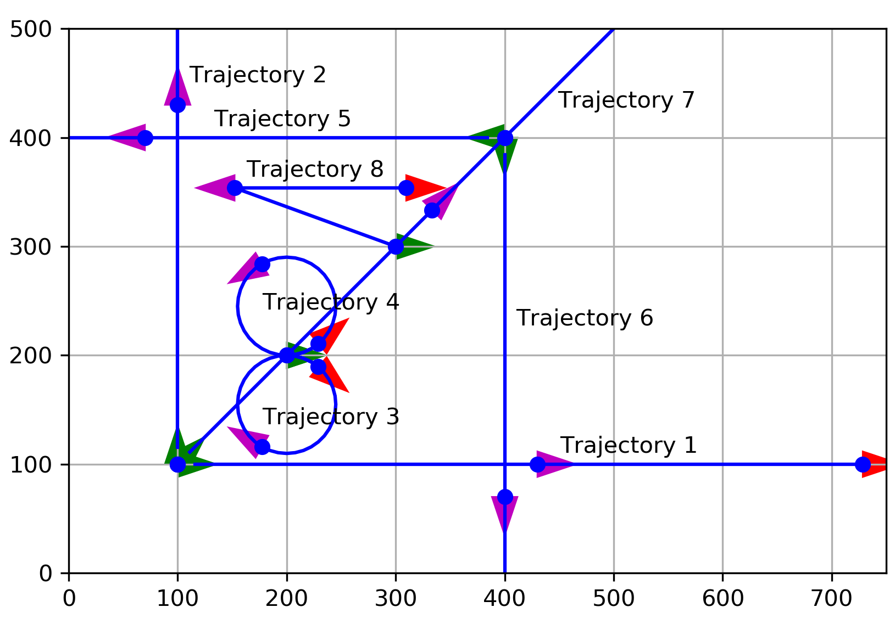
Eight reference trajectories for evaluation and visualization

To characterize the performance of the state estimator, we use mean error and std error between both real trajectory and estimated trajectory.

| trajectory index | with/without knowledge | mean error | std error |
|:----------------:|:----------------------:|:----------:|:--------------:|
|1|perfect knowledge|1.60|1.89|
|1|no knowledge|2.5|3.04|
|2|perfect knowledge|1.1|1.3|
|2|no knowledge|4.48|5.0|
|3|perfect knowledge|1.2|1.3|
|3|no knowledge|3.6|3.8|
|4|perfect knowledge|2.2|2.3|
|4|no knowledge|3.6|4.27|
|5|perfect knowledge|0.8|1.0|
|5|no knowledge|2.7|3.0|
|6|perfect knowledge|1.0|1.3|
|6|no knowledge|5.5|8.3|
|7|perfect knowledge|1.4|1.5|
|7|no knowledge|2.6|3.6|
|8|perfect knowledge|1.6|2.1|
|8|no knowledge|2.4|2.8|

### Visualization

(Left column: perfect knowledge of the initial state; right column: no knowledge of the initial state)

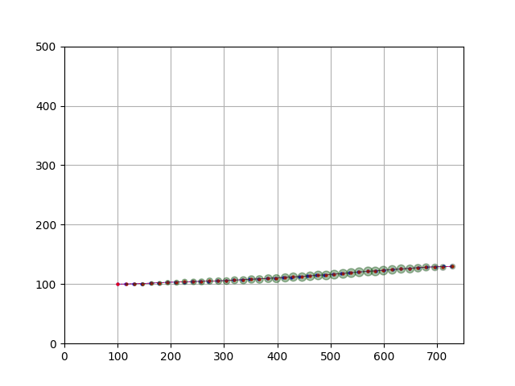 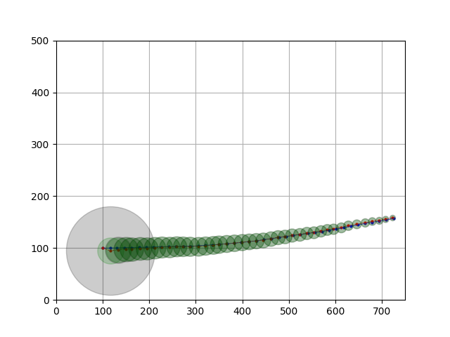

Trajectory No.1: Straight forward line in the direction of +x.

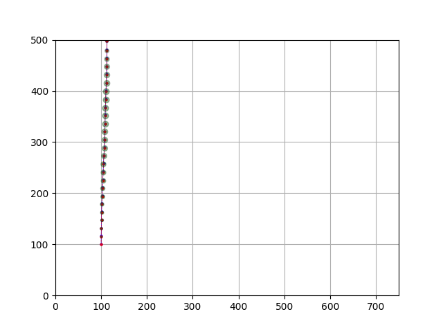 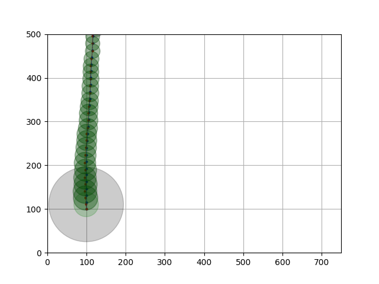

Trajectory No.2: Straight line trajectory heading in the direction of +y.

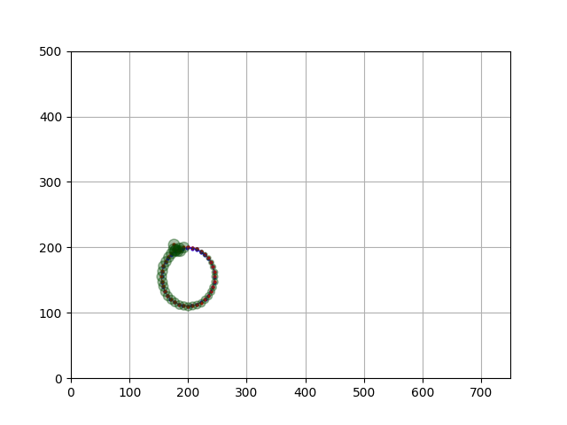 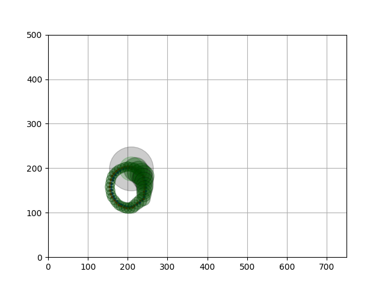

Trajectory No.3: Clockwise circular trajectory.

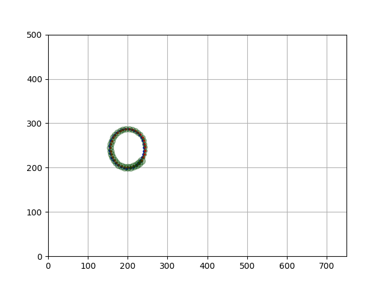 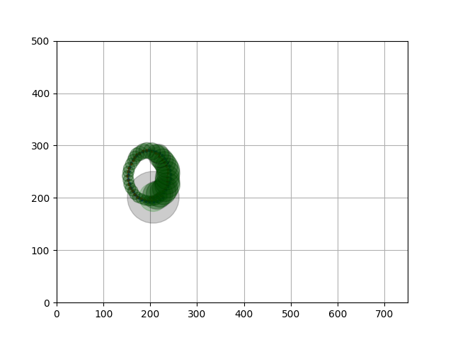

Trajectory No.4: Counter-clockwise circular trajectory.

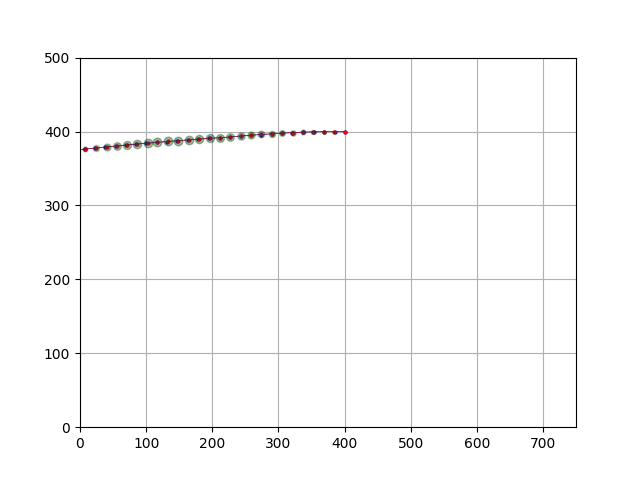 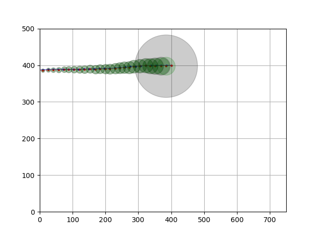

Trajectory No.5: Straight line heading in -x.

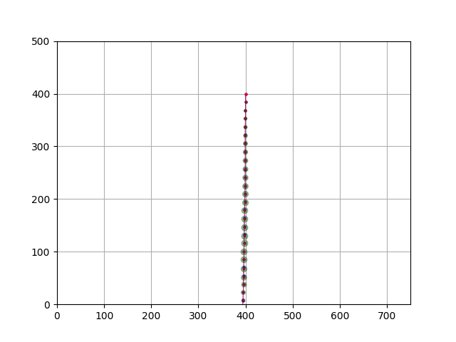 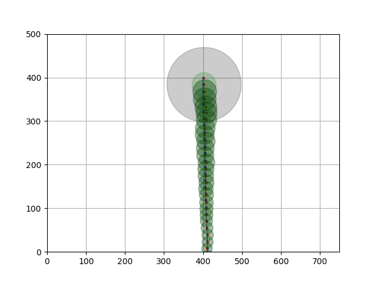

Trajectory No.6: Straight line heading in -y.

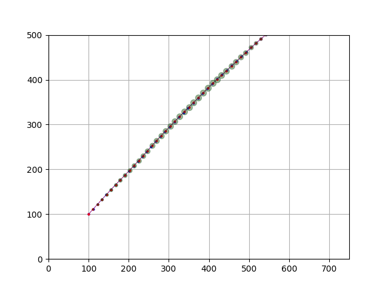 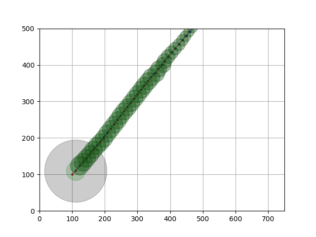

Trajectory No.7: Straight line heading in the direction 45° from +x.

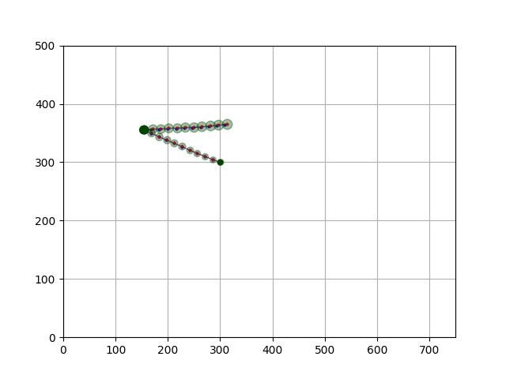 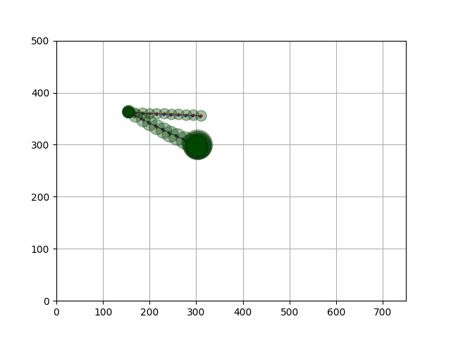

Trajectory No.8: A complex trajectory.

 

Full report see: [report.pdf](lab_3_report.pdf)
